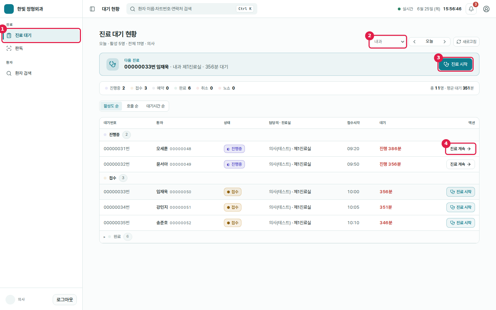
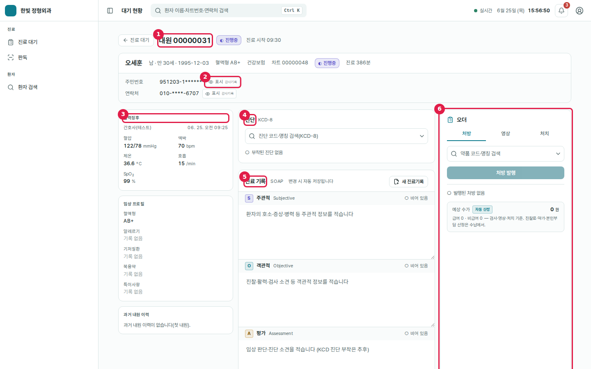

# 도움말 가이드 · 의사(Doctor)

> **데모 계정** `doctor@pms.local` / `Staff1234`
> 의사는 본인 진료과(데모: 내과)만 본다. 진료 완료(내원 종결)는 **수납 finalize가 트리거**하므로 의사는 완료 버튼을 누르지 않는다.

의사는 진료 대기에서 환자를 받아, 진료 허브에서 활력·이력을 확인하고 SOAP 기록·진단 부착·오더(처방/영상/처치)를 한다.

---

## 화면 1 · 진료 대기

| # | 요소 | 설명 |
|---|---|---|
| ① | **진료 대기** 메뉴 | 로그인 시 기본 착지 화면(역할별 홈) |
| ② | **진료과** | 의사는 본인 과(내과)로 **고정** — 다른 과로 바꿀 수 없음 |
| ③ | **진료 시작** | "다음 진료" 배너 — 가장 활성도 높은 대기 환자의 진찰을 시작 |
| ④ | **진료 계속** | 진행중(in_progress) 내원을 이어서 봄 |

**작업 흐름.** 상단 "다음 진료" 배너가 다음 볼 환자를 안내한다 → ③(접수 환자 진찰 시작) 또는 ④(진행중 이어보기)로 **진료 허브**에 진입한다. 목록은 진행중 → 접수 → 완료 순으로 그룹지어 활성도 순·호출 순·대기시간 순 정렬할 수 있다.

---

## 화면 2 · 진료 허브 (3-pane)

| # | 요소 | 설명 |
|---|---|---|
| ① | **내원 헤더** | 내원 번호·상태(진행중)·진료 시작 시각 |
| ② | **주민번호 표시** | 기본은 마스킹(`951203-1******`). "표시"를 누르면 **감사 기록 후** 노출(눈 아이콘·"감사기록" 라벨) |
| ③ | **활력징후** | 간호가 사전 입력한 혈압·맥박·체온·호흡·SpO₂ |
| ④ | **진단(KCD)** | 진단 코드·명칭 검색 → 부착(주/부상병 구분) |
| ⑤ | **진료 기록(SOAP)** | 주관적·객관적·평가·계획 — 변경 시 자동 저장 |
| ⑥ | **오더 패널** | 처방·영상·처치 탭(검체 검사는 수행 주체 부재로 제외). 미수행 오더는 취소 가능 |

**작업 흐름.** 좌측에서 활력·임상 프로필·과거 이력을 확인한다 → 중앙에서 SOAP를 작성하고 진단을 부착한다(주상병이 없으면 완료 불가) → 우측 오더 패널에서 처방·영상·처치를 지시한다(약품·행위는 마스터에서만 선택). 진료가 끝나면 "진료 대기로" 돌아가고, 이후 원무 수납에서 결제하면 내원이 자동으로 완료된다.

---

> 스크린샷은 `tools/screenshots/capture-doctor.mjs`로 재현 가능(클라우드 데모 환경·playwright 자동 캡처 + 번호 하이라이트).
